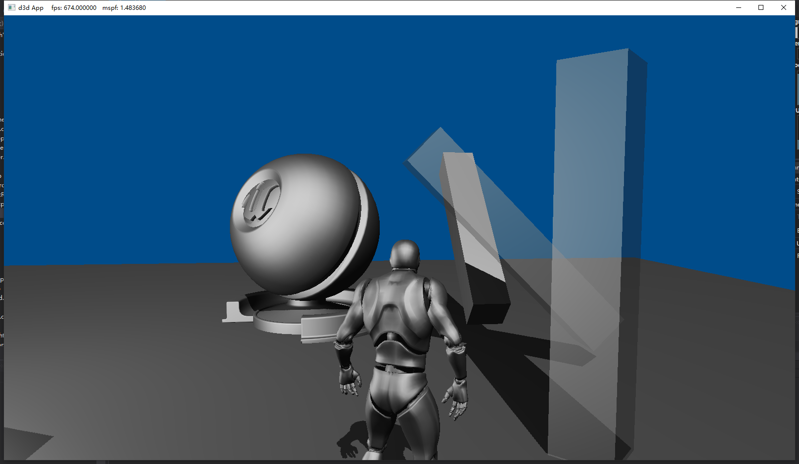
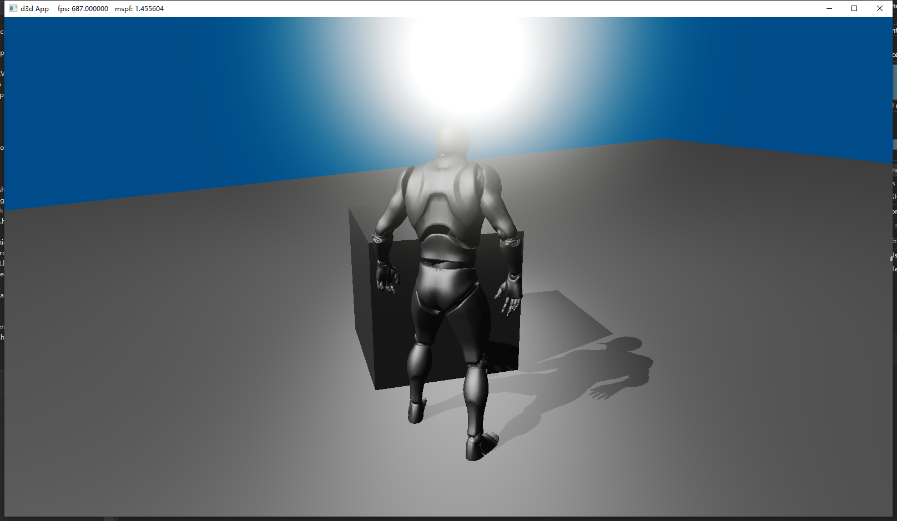
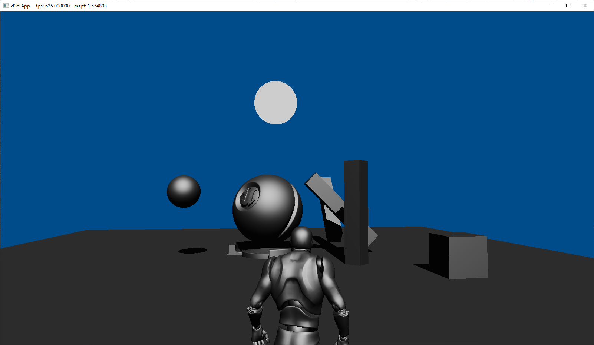
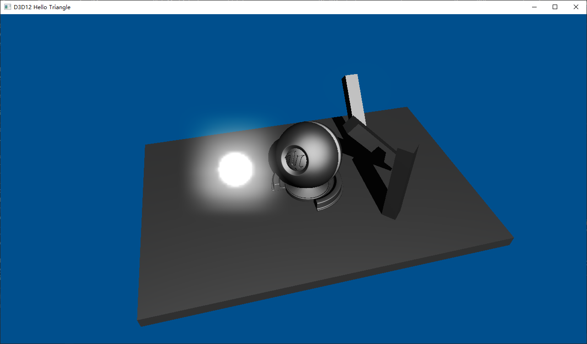
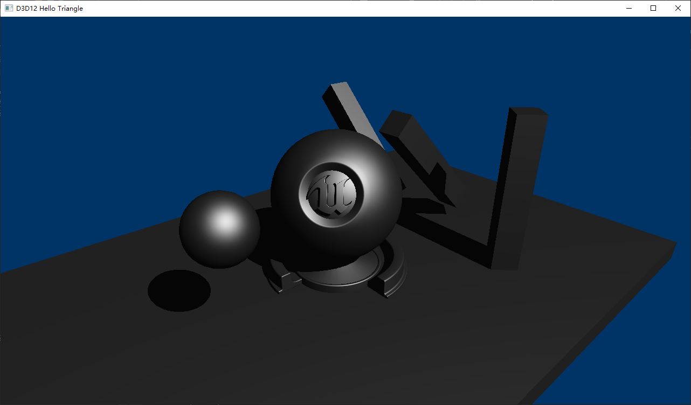
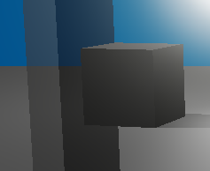
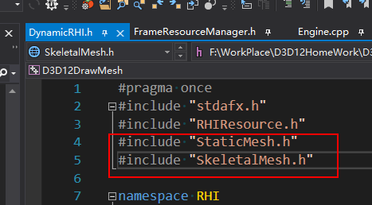

## 运行方式
D3D12DrawMesh下sln工程用vs打开后点击运行。(需要是自带dx12API的win10系统, 并且使用Visual Studio 2019 (v142) 的生成工具)
## 操控方式
按w前进, 鼠标左/右键按住拖动前进视角
## 效果节点(倒序)
1. Translucent(Order dependent)  

2. PointLight(no shadow)  

2. SkeletalMesh  

2. Bloom  

3. Shadow Map  

# 工程结构
1. Actor-ActorComponent  
   Entity-Component-System, 逻辑在Actor中, 数据在Component中
2. Material  
3. Scene  
   所有Actor目前存放在Scene中, 所有game数据分散在actor中
4. RHI  
   dynamic render hardware interface
5. multithreading  
   分为主线程(game逻辑)和Render线程
6. FrameResource  
   渲染需要使用的数据都在FrameResource中，与game线程数据分离
7. tripple buffering  
   在FrameResourceManager中有三个buffer可以存放三组渲染数据, 因此可以接受主线程提交三组命令
8. RenderResource  
   一个特定RR储存了某个Actor在某一个Pass下所需要的大部分渲染资源和信息, 有些渲染需要的constant buffer可能在公共的framebuffer中

# 参考目录
1. rastertek.com
   http://www.rastertek.com/
2. 龙书demo
3. dx12官方demo
4. learnopengl
   https://learnopengl-cn.readthedocs.io/zh/latest/

# TODOList
1. 设计优化
    1.  FrameResource里面存的都是渲染要用的东西，包括Geometry和RenderResource，Sampler和texture，后两者可以放到rr里面吗？有必要吗？
        1.  暂时认为:静态的资源，因为不会产生gpu读和cpu写的竞争所以放在哪都可以
    2.  把light和camera变成lightcomponent，不再是staticcomponent
    3.  RR里面存CB的handle, renderer调用的时候直接遍历RR里面的handle, cb的储存全都放在frameResource
2.  性能优化
    1.  相同的PSO不要重复set
    2.  做性能profile
    3.  给点光源做一个最大光照范围，超出范围的物体不需要渲染点光源光照
    4.  在game线程加一个机制：如果物体在视锥体之外，就不提交绘制它的drawcall
    5.  相同的pso不用反复提交
    6.  push_back改成emplace_back
    7.  只需要3x4矩阵
    8.  可以处理成多线程的东西写成多线程
    9.  减少overdraw
        1.  开启early-z，不透明物体改为由近及远绘制
    10. 对物体的排序不应该根据transform的值，应该根据包围盒的center
3. 新功能
   1. 多点光源, 点光源实时阴影投射
      1. TODO光照算法没改
      2. TODO没有阴影投射
   2. 材质系统设计
      1. 多材质扩展性
         1. ue4材质节点图生成的hlsl代码拷过来，复制代码到本地shader代码的自定义区，即可出ue4导过来的新材质
      2. 引擎需要知道blendmode，shading model，material domain
         1. 因为不同材质不仅影响到shader代码的不同，还与创建RR时管线设置，renderer中渲染顺序有关
         2. blendmode与UE4的靠齐
         3. shading model，material domain暂时不考虑
      3. TODO材质对象需要兼容各种component, 不需要为不同的component创建各自的材质
         1. 在constant buffer中新增一组buffer专门设置开关变量
            1. 比如IsSkeletalMesh, 如果是骨骼模型, 就在VS中加处理权重的shader code
         2. 一个component可能同时有透明和不透明的材质用于不同的submesh, 因此绘制需要以submesh作为单位, 排列绘制顺序时也需要以submesh为单位
      4. 材质参数
         1. 按照: vector数组, float数组, texture数组的方式传入shader
         2. 可以用代码直接设置, 也可以读取ue4导出的二进制文件
   3. 透明物体渲染(顺序有关)
      1. 透明物体pso设置
         1. 打开混合
         2. 打开深度测试
         3. 关闭深度写入
      2. 顺序有关
         1. 不透明物体必须要在透明物体之前渲染, 不然后于透明物体渲染的不透明物体会完全覆盖透明物体, 不会有混合效果  

         2. 该工程透明物体需要按照从远到近的方式依次渲染  
      1. 光照
         1. 接受光照
      2. 阴影
        1. 本身投射不投射阴影可以设置开关控制, 与ue4一样默认不投射
           1. TODO目前投射
        2. 本身不接收阴影
   1. 延迟渲染
   2. AABB视锥剔除等(延后, 显示性能跟不上再做)
   3. 加diffuse,specular,ambient贴图
   4. 加法线贴图
   5. 加cube map
   6.  加天空盒
   7.  加入点光源的点阴影映射
   8.  加抗锯齿
   9.  加描边
   10. 加环境映射
   11. 加AO-参考龙书
   12. 把龙书的特性demo都加上来
1.  新特性
    1.  让灯光可以选择旋转
    2.  导出模型文件里面加上包围盒大小，用于计算平行光的位置
    3.  写一个真正的third person 的相机tick，现在的只是绕定点环绕，不会跟character朝向保持一致
    4.  可以在update时根据逻辑生成和销毁actor，比如子弹射击
2.  代码管理
    1.  fmt第三方库用一下
    2.  vs的format
3.  疑问
    1.  场景中有任意多个光源，被光照的模型怎么写shader，光源数量可以动态传入吗？还是hardcode一个很大的值做长度
    2.  为什么说DX12对多线程有很好的支持认识还不够深入
        1.  与DX11的差异如何导致他在多线程上优于DX11？
    3.  文件引用关系怎么管理
        1.  下图怎么把这两个include去掉(RHI.h里面)
4.  BUG
    1.  找到人物胸前有小片的原因，修复
    2.  退出报错
        1.  D3D12 ERROR: ID3D12Resource2::<final-release>: CORRUPTION: An ID3D12Resource object (0x0000024FD9DD20C0:'ConstantBuffer') is referenced by GPU operations in-flight on Command Queue (0x0000024FD88D1B90:'Unnamed ID3D12CommandQueue Object').  It is not safe to final-release objects that may have GPU operations pending.  This can result in application instability. [ EXECUTION ERROR #921: OBJECT_DELETED_WHILE_STILL_IN_USE] D3D12: **BREAK** enabled for the previous message, which was: [ ERROR EXECUTION #921: OBJECT_DELETED_WHILE_STILL_IN_USE ] Exception thrown at 0x00007FFE1C254B89 (KernelBase.dll) in D3D12DrawMesh.exe: 0x0000087A (parameters: 0x0000000000000001, 0x0000007FF793A2A0, 0x0000007FF793C070). The thread 0x5170 has exited with code 0 (0x0). Unhandled exception at 0x00007FFE1C254B89 (KernelBase.dll) in D3D12DrawMesh.exe: 0x0000087A (parameters: 0x0000000000000001, 0x0000007FF793A2A0, 0x0000007FF793C070).
    3.  RenderDoc显示有疑问
    4.  多一个相同sampler的问题
    5.  ThreadTaskNum有问题，看一下，研究下会不会影响帧率
        1.  打log看Tasks的长度和ThreadTaskNum数

# 技术内容分析记录
1. 延迟渲染架构
      1. 延迟渲染是为了避免光照计算的overdraw
         1. 疑问: 深度剔除为什么一定要在ps之后?深度值不是vs+光栅化之后就产生了吗
      2. Gbuffer信息需要采取合适方式压缩与还原
         1. 疑问: Gbuffer的大小为什么会对io带宽造成压力
            1. 猜想:Gbuffer是每一帧都需要写和读的, 如果太大会导致io带宽问题
      3. 任意数量点光源
         1. 疑问: 如何在shader中确保能够接收任意数量的光源信息? 变长数组在shader中能灵活地实现吗?
      4. 优劣分析
         1. 优
            1. 避免lighting overdraw
            2. 结合SSAO
         2. 劣
            1. 该场景只能用同一种光照算法, 因为在gbuffer上已经无法区分物体
            2. 由于无法区分物体边缘分界，无法使用硬件MSAA，不知道原因是否正确。可以使用FXAA和TXAA
            3. 对透明渲染支持不好, deferred pass不能直接把透明物体信息也放到Gbuffer上, 需要做完延迟渲染之后再渲染透明物体
            4. 带宽问题
               1. 1920 * 1080 * 4RGBA* 4MRT * 60FPS = 1.8GB
               2. 疑问: 后处理的时候不也要一直读写texture吗

<!-- ### 相机操作方式
1. ↑↓←→或WASD控制相机位置
2. 按住鼠标左右键调整视角
3. QE上升与下降 -->
