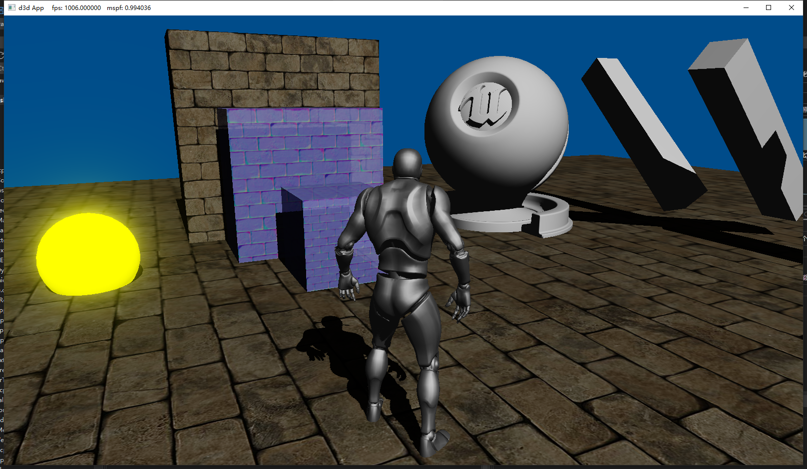

## 运行方式
D3D12DrawMesh下sln工程用vs打开后点击运行。(需要是自带dx12API的win10系统, 并且使用Visual Studio 2019 (v142) 的生成工具)
## 操控方式
按w前进, 鼠标左/右键按住拖动前进视角
## 一些效果
1. Translucent(Order dependent)  

2. PointLight(no shadow)  

2. SkeletalMesh  

2. Bloom  

3. Shadow Map  

4. texturing

# 工程结构
1. Actor-ActorComponent  
   Entity-Component-System, 逻辑在Actor中, 数据在Component中
2. Material  
3. Scene  
   所有Actor目前存放在Scene中, 所有game数据分散在actor中
4. RHI  
   dynamic render hardware interface
5. multithreading  
   分为主线程(game逻辑)和Render线程
6. FrameResource  
   渲染需要使用的数据都在FrameResource中，与game线程数据分离
7. tripple buffering  
   在FrameResourceManager中有三个buffer可以存放三组渲染数据, 因此可以接受主线程提交三组命令
8. RenderResource  
   一个特定RR储存了某个Actor在某一个Pass下所需要的大部分渲染资源和信息, 有些渲染需要的constant buffer可能在公共的framebuffer中

# 参考目录
1. rastertek.com: http://www.rastertek.com/
2. 龙书demo: https://github.com/d3dcoder/d3d12book.git
3. dx12官方demo: https://github.com/microsoft/DirectX-Graphics-Samples.git
4. learnopengl: https://learnopengl-cn.readthedocs.io/zh/latest/

<!-- ### 相机操作方式
1. ↑↓←→或WASD控制相机位置
2. 按住鼠标左右键调整视角
3. QE上升与下降 -->
